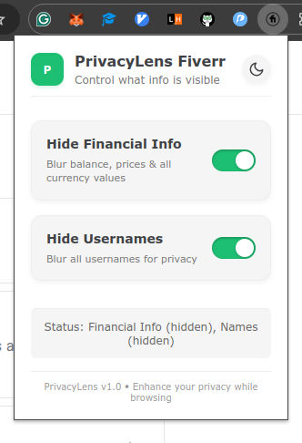
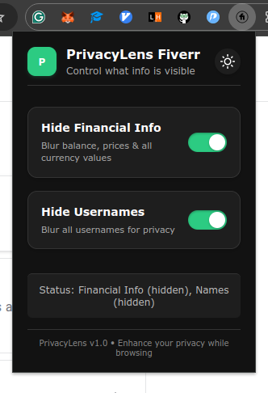
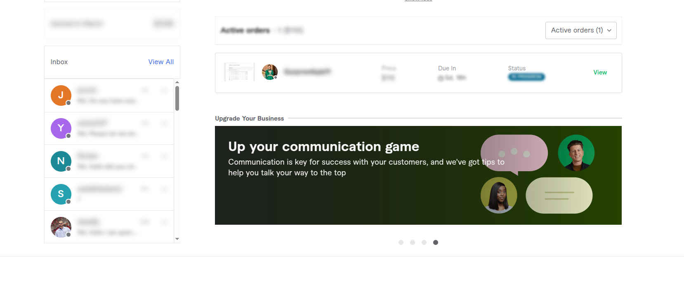
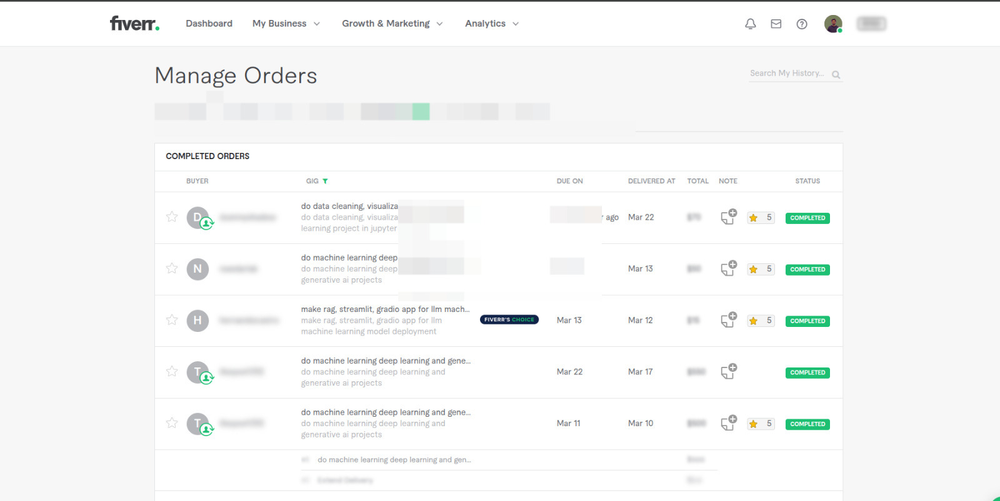

# PrivacyLens Fiverr

## Overview

PrivacyLens Fiverr is a Chrome extension designed to enhance your privacy while using Fiverr. As you know fiverr doesn't have an inbuilt balance hider. Which could be pretty annoying when you want to share your fiverr account but don't want to show your earnings and client information or chat. This extension will help you hide that information with just a click.

  

    
    
  

  
<i>Extension popup: Light and Dark mode</i>

## Features

- **Hide Financial Information**: Blur all balance amounts and prices across all Fiverr pages
- **Hide Usernames**: Blur client usernames throughout Fiverr
- **Dark/Light Mode**: Toggle between themes based on your preference
- **Hover Reveal**: Temporarily reveal hidden information by hovering over blurred elements

## Privacy in Action

  
  
<i>Example of blurred financial information and usernames on Fiverr</i>

  
  
<i>Complete dashboard privacy protection</i>

## Installation

### From Chrome Web Store

1. Visit the [Chrome Web Store](https://chrome.google.com/webstore/) (Coming soon)
2. Search for "PrivacyLens Fiverr"
3. Click "Add to Chrome"

### Manual Installation (Developer Mode - Prefered for now)

1. Download or clone this repository
2. Open Chrome and navigate to `chrome://extensions/`
3. Enable "Developer mode" in the top-right corner
4. Click "Load unpacked" and select the extension directory
5. The extension should now appear in your browser toolbar

## How to Use

1. Click the PrivacyLens icon in your browser toolbar while on Fiverr
2. Toggle the switches to enable/disable hiding of:
   - Financial Information
   - Usernames
3. Changes take effect immediately without refreshing the page (Refresh persistent as well)
4. Hover over any blurred element to temporarily reveal its content
5. Click the theme toggle button to switch between light and dark mode

## Privacy & Permissions

- PrivacyLens works entirely client-side and does not collect or transmit any data
- Required permissions:
  - `activeTab`: To interact with Fiverr pages
  - `storage`: To remember your settings between sessions

## Troubleshooting

- **Extension not working?** Try refreshing the page
- **Missing some elements?** The extension periodically scans for new content, but some dynamically loaded elements might take a moment to be detected

## Contributing

Contributions are welcome! Feel free to submit pull requests or open issues to help improve PrivacyLens.

---

  
Built with ♥ using GitHub Copilot + Claude 3.7 Sonnet

